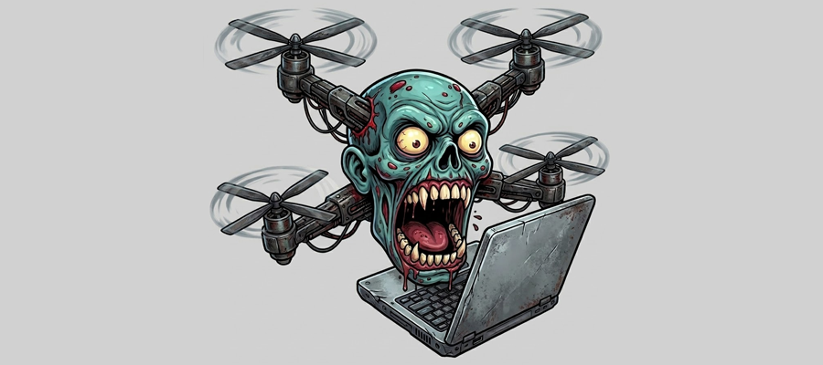

# Infected Drones

**Drone-to-Ground Control Station attack vectors, vulnerabilities & exploits**

Drone fleets today are one operator flying dozens or hundreds of drones from a
single ground station. This makes the ground control station a valuable target for adversaries.
It is where the pilot is usually located, it often stores mission data, and it is a prime vector
for lateral movement across UxS networks and other drones in a fleet.

  

Most drone security research has focused on targeting the drone. The <a href="https://github.com/nicholasaleks/infected-drones">Infected Drone</a> research takes an
alternative approach and highlights how a single compromised drone can attack ground stations that connect to it.
Because most ground control software trusts whatever the drone sends it, there is a lack of
authentication, validation, and sanitization, allowing data from a compromised
drone to lead to file CRUD, code execution, or a crash on the operator's machine.

---

## Findings

Legend:
* ✅ reliable with that vector
* ⚠️ possible, but conditional, racy, or needs extra steps
* ❌ not applicable for this finding via that vector

**Delivery class** is what the attacker has to do on the link, and it decides which vectors work.
*Push* findings need only a frame arriving at the GCS, so any injection-capable vector is enough.
*Handshake* and *request/response* findings need the attacker to be, or fully control, the
conversational peer, which favours an on-bus peripheral, a compromised companion, the supply
chain, or a full MITM.

| ID | Product | Sev | CWE | Sink class | Delivery class | Infected FC / supply chain? | Malicious on-bus peripheral? | Compromised companion? | WiFi/UDP inject? | TCP/cloud MITM? | [SiKW00F](https://github.com/nicholasaleks/sikw00f) injection? | SiK full-MITM? | Fix PR |
|---|---|---|---|---|---|---|---|---|---|---|---|---|---|
| [QGC-02](QGC-02_component_metadata_uri_ssrf/) | QGroundControl | 🔴 **CRITICAL** | 22/73/494/918 | COMPONENT_METADATA uri → arbitrary file write → **zero-click RCE upon connection** | request/response (URI fetch over IP) | ✅ | ✅ emits metadata uri | ✅ | ✅ for trigger | ✅ | ⚠️ push trigger yes; fetch is over IP | ✅ | branch ready |
| [MP-01](MP-01_mavftp_plugin_rce/) | Mission Planner | 🟠 HIGH | 22→94 | MAVFTP traversal → plugin-loader RCE | handshake (MAVFTP req/ack → RCE) | ✅ | ✅ peer answers listing | ✅ full link control | ⚠️ inject easy, but need to own handshake | ✅ rewrite at relay | ⚠️ must win race + match session/seq | ✅ bridge owns FTP convo | branch ready |
| [MP-02](MP-02_gst_pipeline_injection/) | Mission Planner | 🟠 HIGH | 94/78 | `gst://` → `gst_parse_launch` (file r/w + exfil) | push (VIDEO_STREAM_INFORMATION → gst) | ✅ | ✅ camera announces uri | ✅ | ✅ UDP datagram | ✅ | ✅ one-shot stream frame | ✅ trivially | pending |
| [QGC-01](QGC-01_camera_info_path_traversal_write/) | QGroundControl | 🟠 HIGH | 22/73/170 | CAMERA_INFORMATION → path-traversal write (**zero-click write upon connection**) | push (CAMERA_INFORMATION) + content via cam_definition_uri | ✅ | ✅ most natural (camera) | ✅ | ✅ | ✅ | ✅ trigger is push; name fields inline | ✅ | pending |
| [QGC-03](QGC-03_ftp_download_write_and_offset/) | QGroundControl | 🟠 HIGH | 22/770 | FTP listing → traversal write + offset disk-fill | handshake (MAVFTP listing/download) | ✅ | ✅ peer answers FTP | ✅ | ⚠️ inject yes, own-handshake harder | ✅ | ⚠️ racy session/seq | ✅ bridge serves listing | pending |
| [MAVSDK-01](MAVSDK-01_component_metadata_curl_ssrf/) | MAVSDK | 🟠 HIGH | 918/749 | component-metadata curl SSRF + `file://` | request/response (COMPONENT_METADATA.uri fetch over IP) | ✅ | ✅ emits metadata uri | ✅ | ✅ for trigger | ✅ | ⚠️ push trigger yes; fetch over IP | ✅ | pending |
| [MAVSDK-02](MAVSDK-02_camera_cam_definition_ssrf_traversal/) | MAVSDK | 🔴 **CRITICAL**/HIGH | 22/73/918 | cam-definition SSRF + `mftp://` traversal → **zero-click arbitrary file deletion** | push (CAMERA_INFORMATION.cam_definition_uri, auto) | ✅ | ✅ most natural (camera) | ✅ | ✅ | ✅ | ✅ auto-consumed push | ✅ | pending |
| [MAVSDK-03](MAVSDK-03_lzma_decompression_bomb/) | MAVSDK | 🟠 HIGH | 409/400/770/459 | `.xz` cam-definition → unbounded decompression → **persistent disk exhaustion** | push (CAMERA_INFORMATION.cam_definition_uri, auto) — a bare HEARTBEAT starts it | ✅ | ✅ most natural (camera) | ✅ | ✅ | ✅ | ✅ auto-consumed push; ~50 s of 57.6 kbps airtime per 2 GiB | ✅ | pending |
| [MAVPROXY-01](MAVPROXY-01_asterix_pickle_rce/) | MAVProxy | 🟠 HIGH | 502 | asterix `pickle.loads` over UDP → RCE | IP side-channel (UDP, NOT the MAVLink RF link) | ❌ not on the MAVLink link | ❌ separate UDP socket | ⚠️ only if it can reach :45454 | ✅ UDP to host:45454 | ❌ own UDP socket, not relay | ❌ not on RF/MAVLink link | ❌ not on RF/MAVLink link | fixed upstream by [#1728](https://github.com/ArduPilot/MAVProxy/pull/1728), unreleased |
| [MAVROS-01](MAVROS-01_param_id_map_dos/) | mavros | 🟡 MED | 345/770 | PARAM_VALUE → forged global `/parameter_events` + uncapped map | push/stream (inject PARAM_VALUE, no handshake) | ✅ | ✅ emits PARAM_VALUE | ✅ | ✅ UDP flood | ✅ | ✅ flood PARAM_VALUE | ✅ | pending |
| [MP-03](MP-03_statustext_process_start/) | Mission Planner | 🟠 HIGH | 74/601 | STATUSTEXT markup → `Process.Start` | push (STATUSTEXT → ShellExecute) | ✅ | ✅ any component emits | ✅ | ✅ | ✅ | ✅ fire-and-forget text | ✅ | pending |
| [QGC-04](QGC-04_dataflash_bin_parser_oob/) | QGroundControl | 🟡 MED | 191/125 | DataFlash `.bin` parser OOB read + underflow | handshake (log download of malicious .bin) | ✅ | ✅ peer serves DataFlash | ✅ | ⚠️ | ✅ | ⚠️ must serve log chunks | ✅ bridge feeds .bin | pending |
| [MAVROS-02](MAVROS-02_ftp_uncaught_exception_dos/) | mavros | 🟠 **HIGH** | 125/617/248 | FTP write-ack → unbounded `std::advance` → **heap disclosure** + process abort | handshake (poison FTP reply → crash) | ✅ | ✅ peer sends bad FTP | ✅ | ⚠️ | ✅ | ⚠️ must land malformed reply | ✅ bridge injects bad reply | pending |
| [MP-04](MP-04_param_total_connect_dos/) | Mission Planner | 🟡 MED | 248/20/1050 | `RALLY_TOTAL`/`FENCE_TOTAL` → unvalidated `int.Parse` + O(n²) on the UI thread (**zero-click on connect**) | push (PARAM_VALUE, auto post-connect) | ✅ | ✅ emits PARAM_VALUE | ✅ | ✅ | ✅ | ⚠️ must land the param in MP's dict | ✅ | pending |
| [QGC-05](QGC-05_parampck_uninit_stack_disclosure/) | QGroundControl | 🟡 MED | 457/908 | `param.pck` prefix-delta decompressor reads uninitialized stack into parameter **names** | handshake (`@PARAM/param.pck` over MAVLink-FTP, auto on connect) | ✅ | ✅ peer answers FTP | ✅ | ⚠️ inject yes, own-handshake harder | ✅ | ⚠️ racy session/seq | ✅ bridge serves param.pck | pending |
| [DRONEKIT-01](DRONEKIT-01_trust_boundary_handoff/) | DroneKit | ⚪ INFO | 20 | trust-boundary handoff (param_id / STATUSTEXT) | push (telemetry → app callbacks; by-design handoff) | ✅ | ✅ any component | ✅ | ✅ | ✅ | ✅ any push frame reaches callback | ✅ | pending |

---

## Delivery vectors

The matrix scores seven columns per finding: the five vectors below, plus the two SiK radio
(RF telemetry) modes, which get their own callout after given the injection-vs-MITM nuance.

1. **Infected flight controller, serial connection, or supply chain.** A local attacker or a malicious
   flight controller gets physically connected to the GCS host or the radio. The vehicle or firmware is
   something the operator did **not** build: a demo unit, rental, seized airframe, or second-hand craft,
   whose firmware is implanted to emit hostile MAVLink the moment a GCS connects.
   The operator's *own* GCS is the victim; the "vehicle" was hostile before it was
   ever powered on. Applies to every finding, and is the cleanest way to deliver
   *connect-time* handshake exploits. This extends to forensic analysts who may connect directly to
   or extract data from an infected vehicle. Those artifacts, if not properly handled,
   could infect or spread to the analyst's computer and network.

2. **Malicious / counterfeit MAVLink peripheral on the vehicle's own bus.** A
   third-party camera, gimbal, ADSB-in, rangefinder, or any device that *speaks
   MAVLink and is itself the attacker.* It is a *legitimate participant* on the
   link emitting hostile frames. A counterfeit "smart camera" advertising
   poisoned messages is doing exactly what a real one does, just with
   hostile values.

3. **Compromised companion computer onboard** (Raspberry Pi / Jetson running
   mavlink-router / MAVProxy). Once compromised it *becomes* the vehicle endpoint,
   with full bidirectional access to the link and visibility of its live state. It can
   answer any handshake and emit any push frame, which makes it viable for every
   finding in this set.

4. **WiFi / UDP telemetry bridge** (ESP8266 / ESP32 "wifi telemetry"). Anyone on the
   access point or LAN can inject MAVLink data. This collapses the cost of the injection vectors to
   near zero and, for an attacker who can also intercept (ARP/AP MITM), enables
   full handshake control too.

5. **TCP / cloud relay** (SITL, mavlink-router TCP, mavp2p, 4G/LTE cloud GCS such
   as commercial UAV-cloud services). MITM at the relay, or anyone who can reach
   the exposed TCP port, can rewrite the stream. Cloud/4G links widen the
   geographic blast radius enormously and frequently lack mutual auth.

### SiK radio (RF telemetry link)

The dominant real-RF telemetry path for ArduPilot/PX4 hobby and prosumer craft is
a [SiK radio pair](https://ardupilot.org/copter/docs/common-sik-telemetry-radio.html), a transparent serial bridge that does not parse or
validate MAVLink, so it offers the GCS zero protection against hostile content.
A rogue SiK module joins or bridges an existing link using
[sikw00f](https://github.com/nicholasaleks/sikw00f). Two attack modes, with very
different reliability:

- **Injection (one rogue radio).** [sikw00f](https://github.com/nicholasaleks/sikw00f)
  can transmit hostile frames onto the shared channel once synced to the link.
  Reliable for one-shot push/stream messages (`STATUSTEXT`, `PARAM_VALUE`,
  `CAMERA_INFORMATION`, etc.), no reply needed. Unreliable for handshake
  protocols (MAVFTP, param/log download) since the injector must win an airtime
  race and match a session/sequence it doesn't control.
- **Full-MITM (rogue pair).** Two [sikw00f](https://github.com/nicholasaleks/sikw00f)
  radios, one facing the GCS, one facing the vehicle to bridge and rewrite frames
  in flight (optionally after jamming to force re-association). This owns the
  entire conversation, so it reliably satisfies handshakes too.

Note: SiK encryption (AES-128, where supported) ships off by default with a static
shared key.
